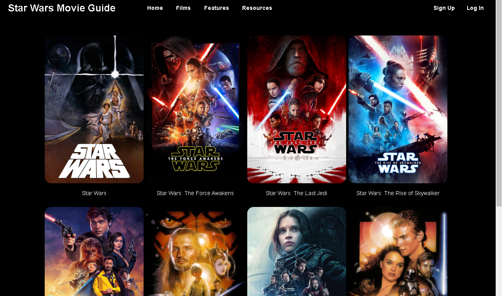

# Table of Contents

1.  [Star Wars Movie Guide](#org3d7a303)
2.  [Introduction](#org4d0022b)
3.  [Getting Started](#org971271f)
4.  [Screenshots](#org92a06b1)
5.  [API](#orgb45b854)
6.  [Storage](#org0ba5a9b)
7.  [Related Projects](#orgd1fb943)
8.  [Future](#orgc826140)
9.  [Authors](#org8dd2071)
10. [Acknowledgements](#orge05ebb6)
11. [License](#org1a6599e)

# Star Wars Movie Guide

Explore the galaxy far, far away with ease

# Introduction

Star Wars Movie Guide is a web application that allows anyone to embarkon an
epic journey through the Star Wars universe with a comprehensive
Movie Guide. Uncover the secrets of your favorite films, delve into the rich
lore, and explore the captivating characters that have captured the hearts of
millions across the galaxy. Whether you're a die-hard fan or a newcomer to the
franchise, our Star Wars Movie Guide is your ultimate companion. Join me now and
may the Force be with you on this incredible adventure!

# Getting Started

1.  Visit the [Star Wars Movie Guide](http://34.232.69.25/) page.
2.  Create account or login with custom credentials or OAuth
3.  Explore Star Wars Movie Guide

# Screenshots

The landing page

The sign up page

The login page

The films page

# API

I used <https://api.themoviedb.org/> API to fetch all resources for my backend. I
then create end points for the front-end to utilized the customized api.

# Storage

Data from the themoviedb API is fetched, stored in-memory using Redis and sent to
the front-end.

# Related Projects

-   [AirBnB Clone](https://github.com/fk2019/AirBnB_clone_v4)

# Future

-   Implement MySQL storage for users and related info
-   Implement more loggin options/authorizations
-   Add more search options
-   Add addtional UI/UX designs
-   And many more into the galaxy!

# Authors

[Francis Kamau](https://github.com/fk2019)

Francis is a Software Engineer trained by [ALX](https://www.alxafrica.com/) and equipped with key skills
required in a variety of cyber industries.

Please feel free to reach out to [Francis](https://github.com/fk2019) for any collaboration
opportunities or inquiries.

# Acknowledgements

-   ALX staff: Your unwavering support has made immense impact on my projects.
-   Cohort 9 and all peers: Thanks so much for your motivation and support.
-   The MovieDB: A huge thanks to the entire team for providing us software
    engineers with a great API to work with.
-   \#TeamEmacs: For saving from me the hell of exiting vim :)

# License

This project is licensed under the terms of the MIT license.
Please see the [LICENSE](https://github.com/fk2019/Star_Wars_Movie_Guide/blob/master/LICENSE.txt) file for more details.

